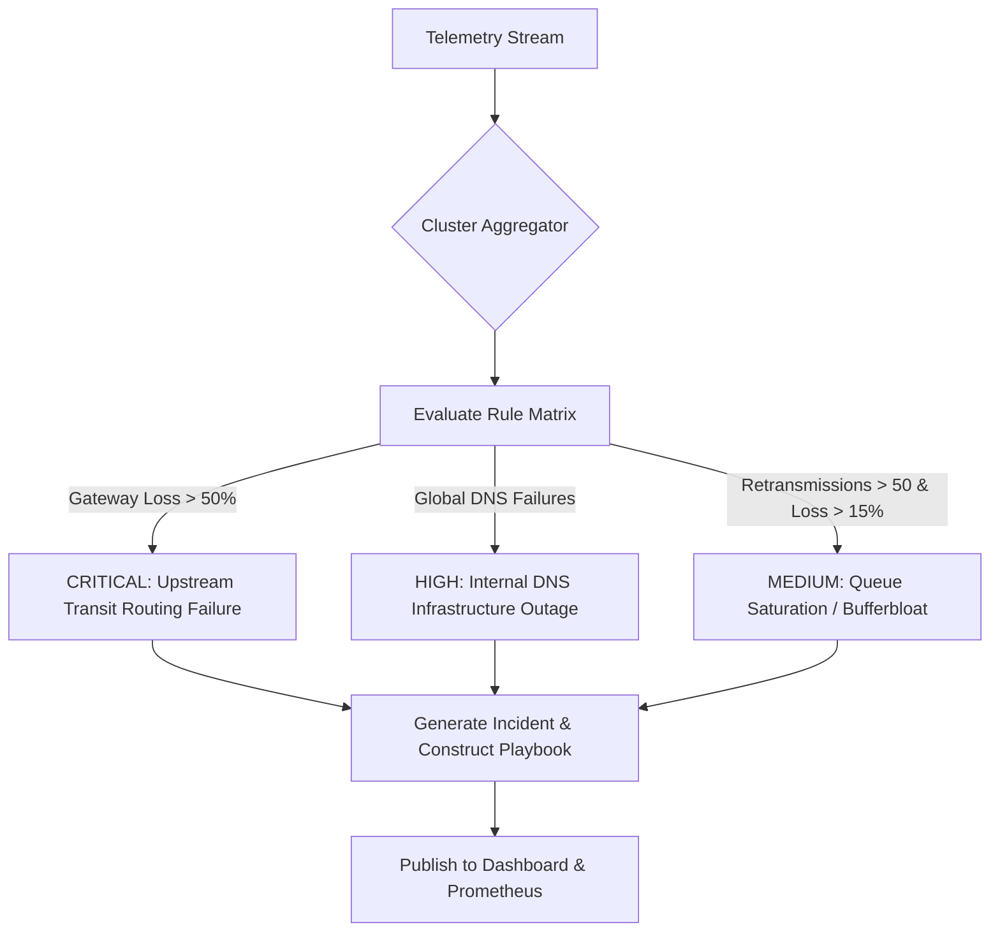

<div align="center">

# 🛰️ Distributed Network Incident Investigation Platform (DNIIP)

*Enterprise Linux Network Observability, Distributed Telemetry, Event Correlation & Root Cause Analysis Engine*

**Production-Grade C++20 Systems Engineering Project**

[](https://en.cppreference.com/w/cpp/20)
[](https://man7.org/linux/man-pages/)
[](https://man7.org/linux/man-pages/man7/epoll.7.html)
[](https://www.postgresql.org/)
[](https://www.sqlite.org/)
[](https://www.docker.com/)
[](#license)

</div>

---

## 📋 Table of Contents

- [Overview](#-overview)
- [Architecture & Data Flow](#-architecture--data-flow)
- [Key Features](#-key-features)
- [Repository Structure](#-repository-structure)
- [Custom TCP Protocol Specification](#-custom-tcp-protocol-specification)
- [Database Schemas](#-database-schemas)
- [Correlation & Root Cause Analysis (RCA) Engine](#-correlation--root-cause-analysis-rca-engine)
- [Building & Installation](#-building--installation)
- [Docker Deployment](#-docker-deployment)
- [React Investigation Dashboard](#-react-investigation-dashboard)
- [Validation & Fault Injection Testing](#-validation--fault-injection-testing)
- [Skills Demonstrated](#-skills-demonstrated)
- [License](#-license)

---

## 🎯 Overview

The **Distributed Network Incident Investigation Platform (DNIIP)** is an enterprise-grade Linux observability and automated root cause analysis system written in **C++20**. It is engineered to simulate high-scale platform telemetry infrastructure similar to industry systems like *Cisco ThousandEyes*, *HPE Aruba Central*, *Datadog*, and *Splunk*.

DNIIP consists of two primary C++ native components:
1. **`dniip-agent`**: A low-overhead Linux daemon that harvests raw system and network telemetry directly from `/proc`, sysfs, and raw ICMP sockets, featuring a local **SQLite Store-and-Forward** buffer for network partition resilience.
2. **`dniip-server`**: A high-performance, non-blocking **`epoll` Reactor server** capable of handling thousands of concurrent agent sockets, feeding telemetry through a lock-free queue into an automated **Event Correlation & Root Cause Analysis (RCA) Engine**.

---

## 🏗️ Architecture & Data Flow

```
+-----------------------------------------------------------------------------------+
|                                  AGENT DAEMON                                     |
|                                                                                   |
|  +--------------------+   +--------------------+   +---------------------------+  |
|  | /proc Collectors   |   | ICMP / Socket      |   | SQLite Store-and-Forward  |  |
|  | Procfs, Sysfs, Net |   | Diagnostics        |   | Buffer Database           |  |
|  +---------+----------+   +---------+----------+   +-------------+-------------+  |
|            |                        |                        |                    |
|            +-------------------+    |    +-------------------+                    |
|                                |    |    |                                        |
|                                v    v    v                                        |
|                        +-----------------------+                                  |
|                        | Custom TCP Transport  |                                  |
|                        | Ring-Buffered Framing |                                  |
|                        +-----------+-----------+                                  |
+------------------------------------|----------------------------------------------+
                                     | Custom TCP Framing Protocol
                                     v
+-----------------------------------------------------------------------------------+
|                             CENTRAL SERVER SYSTEM                                 |
|                                                                                   |
|  +-----------------------------------------------------------------------------+  |
|  | High-Performance Non-Blocking Epoll Reactor Core Engine                       |  |
|  +-------------------------------------+---------------------------------------+  |
|                                        |                                          |
|                                        v                                          |
|  +-----------------------------------------------------------------------------+  |
|  | Lock-Free Multi-Producer Multi-Consumer (MPMC) Queue                          |  |
|  +-------------------------------------+---------------------------------------+  |
|                                        |                                          |
|                                        v                                          |
|  +-----------------------------------------------------------------------------+  |
|  | Worker Thread Pool Pipeline                                                 |  |
|  | +-----------------------+ +-----------------------+ +---------------------+ |  |
|  | | Correlation Engine    | | Incident Generation   | | Root Cause Analysis | |  |
|  | | Topology Rule Engine  | | Severity Thresholds   | | Graph & Inference | |  |
|  | +-----------------------+ +-----------------------+ +---------------------+ |  |
|  +-------------------------------------+---------------------------------------+  |
|                                        |                                          |
|                                        v                                          |
|  +-----------------------------------------------------------------------------+  |
|  | PostgreSQL Database Layer (Partitioned Storage & Indices)                    |  |
|  +-------------------------------------+---------------------------------------+  |
|                                        |                                          |
|                                        v                                          |
|  +-----------------------------------------------------------------------------+  |
|  | REST API Server & Observability Exporters                                   |  |
|  | Prometheus Endpoint | WebSocket Streaming | React / TS Dashboard            |  |
|  +-----------------------------------------------------------------------------+  |
+-----------------------------------------------------------------------------------+
```

---

## ✨ Key Features

- 🐧 **Native Kernel Telemetry Harvesting**: Direct extraction of CPU, memory, socket state, network interface counters, routing tables, and TCP retransmissions via `/proc/stat`, `/proc/meminfo`, `/proc/net/dev`, and `/proc/net/snmp`.
- ⚡ **Non-Blocking Epoll Reactor Core**: High-throughput multiplexed TCP server built using `epoll_create1()`, `epoll_ctl()`, and `epoll_wait()` in Edge-Triggered (`EPOLLET`) mode, capable of serving 1000+ simultaneous agents.
- 📦 **Custom TCP Wire Protocol**: Binary header with magic byte validation (`0x444E4950`), dynamic payload length indicators, CRC32 checksums, and explicit message type indicators.
- 💾 **Store-and-Forward Resiliency**: Local SQLite database with Write-Ahead Logging (WAL) on the agent to safely buffer telemetry during network dropouts and automatically replay data upon reconnect.
- 🧠 **Automated RCA Engine**: Dynamic multi-variable rule matrix evaluating packet loss, socket retransmission spikes, DNS failures, and gateway reachability to infer fault states (e.g., *Transit Routing Failure*, *DNS Outage*, *Bufferbloat Congestion*).
- 📊 **Partitioned Storage & Observability**: Partitioned PostgreSQL database schema, native Prometheus metrics exporter (`:9100`), Grafana dashboard integration, and a modern React/TypeScript investigation console.

---

## 📂 Repository Structure

```text
distributed-network-incident-platform/
├── CMakeLists.txt
├── README.md
├── docker-compose.yml
├── server_schema.sql
├── agent_buffer.sql
├── agent/
│   ├── CMakeLists.txt
│   ├── main.cpp
│   ├── collectors/          # /proc filesystem metrics parsers
│   ├── diagnostics/         # ICMP ping, raw socket & DNS probes
│   ├── networking/          # Non-blocking TCP client connection state
│   └── storage/             # SQLite store-and-forward engine
├── server/
│   ├── CMakeLists.txt
│   ├── main.cpp
│   ├── epoll_server/        # Linux epoll event reactor framework
│   ├── correlation_engine/  # Rule evaluation & root cause inference
│   ├── incident_engine/     # Automated incident generation lifecycle
│   └── database/            # PostgreSQL connection pool layer
├── common/
│   ├── protocol.hpp         # Binary framing & packet structure
│   ├── logger.hpp           # Structured thread-safe logging
│   └── mpmc_queue.hpp       # Lock-free telemetry task queue
├── dashboard/               # React + TypeScript + Material UI UI
├── monitoring/              # Prometheus scrapers & Grafana dashboards
├── systemd/                 # Production systemd unit service files
└── docker/                  # Multi-stage production Dockerfiles
```

---

## 🛰️ Custom TCP Protocol Specification

Communication bypasses heavy HTTP overhead in favor of a packed binary frame structure.

```
 0                   1                   2                   3
 0 1 2 3 4 5 6 7 8 9 0 1 2 3 4 5 6 7 8 9 0 1 2 3 4 5 6 7 8 9 0 1
+-+-+-+-+-+-+-+-+-+-+-+-+-+-+-+-+-+-+-+-+-+-+-+-+-+-+-+-+-+-+-+-+
|       Magic Header (0x44 0x4E 0x49 0x50) -> 'DNIP'            |
+-+-+-+-+-+-+-+-+-+-+-+-+-+-+-+-+-+-+-+-+-+-+-+-+-+-+-+-+-+-+-+-+
| Version (0x01) | Message Type |           Reserved            |
+-+-+-+-+-+-+-+-+-+-+-+-+-+-+-+-+-+-+-+-+-+-+-+-+-+-+-+-+-+-+-+-+
|                     Payload Length (uint32)                   |
+-+-+-+-+-+-+-+-+-+-+-+-+-+-+-+-+-+-+-+-+-+-+-+-+-+-+-+-+-+-+-+-+
|                     Payload CRC32 Checksum                    |
+-+-+-+-+-+-+-+-+-+-+-+-+-+-+-+-+-+-+-+-+-+-+-+-+-+-+-+-+-+-+-+-+
|                                                               |
+                      Payload Bytes (JSON)                     +
|                                                               |
+-+-+-+-+-+-+-+-+-+-+-+-+-+-+-+-+-+-+-+-+-+-+-+-+-+-+-+-+-+-+-+-+
```

| Field | Type | Description |
|---|---|---|
| **Magic Header** | `uint32_t` | Constant identifier `0x444E4950` ("DNIP") |
| **Version** | `uint8_t` | Protocol specification version (`0x01`) |
| **Message Type** | `uint8_t` | `0x01` (Heartbeat), `0x02` (Telemetry), `0x81` (Server ACK) |
| **Payload Length** | `uint32_t` | Length of following JSON body in bytes |
| **CRC32** | `uint32_t` | Integrity verification checksum of the JSON payload |

---

## 🗄️ Database Schemas

### SQLite Buffer Schema (`agent_buffer.sql`)

Used for local store-and-forward persistence during link degradation:

```sql
PRAGMA journal_mode = WAL;
PRAGMA synchronous = NORMAL;

CREATE TABLE IF NOT EXISTS telemetry_buffer (
    id INTEGER PRIMARY KEY AUTOINCREMENT,
    payload_uuid TEXT NOT NULL UNIQUE,
    created_at TIMESTAMP DEFAULT CURRENT_TIMESTAMP,
    sync_status INTEGER DEFAULT 0, -- 0: Unsent, 1: Transmitting, 2: Synced
    retry_count INTEGER DEFAULT 0,
    payload_size INTEGER NOT NULL,
    payload BLOB NOT NULL
);

CREATE INDEX IF NOT EXISTS idx_telemetry_sync_status ON telemetry_buffer(sync_status, id);
```

### PostgreSQL Partitioned Central Schema (`server_schema.sql`)

Telemetry is range-partitioned by timestamp for high-speed indexing and retention management:

```sql
CREATE TABLE telemetry (
    id UUID DEFAULT uuid_generate_v4(),
    node_id VARCHAR(64) REFERENCES nodes(node_id) ON DELETE CASCADE,
    recorded_at TIMESTAMPTZ WITH TIME ZONE NOT NULL,
    cpu_user_pct REAL NOT NULL,
    mem_used_bytes BIGINT NOT NULL,
    tcp_retransmits INT NOT NULL,
    packet_loss_pct REAL NOT NULL,
    rtt_ms REAL NOT NULL,
    gateway_reachable BOOLEAN NOT NULL,
    dns_healthy BOOLEAN NOT NULL,
    PRIMARY KEY (recorded_at, node_id, id)
) PARTITION BY RANGE (recorded_at);
```

---

## 🧠 Correlation & Root Cause Analysis (RCA) Engine

The RCA engine continuously aggregates telemetry frames across node clusters to evaluate correlation rules:



---

## 🛠️ Building & Installation

### Prerequisites

- GCC 10+ or Clang 11+ with C++20 support
- CMake 3.18+
- SQLite3 and libpq (PostgreSQL client) development headers

```bash
# Ubuntu / Debian Dependencies
sudo apt-get update && sudo apt-get install -y \
    build-essential cmake libsqlite3-dev libpq-dev \
    libspdlog-dev libfmt-dev pkg-config
```

### Compile Project

```bash
mkdir -p build && cd build
cmake -DCMAKE_BUILD_TYPE=Release ..
make -j$(nproc)
```

This generates two main binaries:
- `bin/dniip-agent`: Telemetry collection daemon
- `bin/dniip-server`: High-performance central collector server

---

## 🐳 Docker Deployment

To spin up the full platform including PostgreSQL, Central Server, Prometheus, and Grafana:

```bash
docker-compose up -d --build
```

### Monitored Endpoints

- **Central Server TCP Collector**: `tcp://localhost:9000`
- **REST & Dashboard API**: `http://localhost:8080`
- **Prometheus Metrics**: `http://localhost:9100/metrics`
- **Grafana Workspace**: `http://localhost:3000` (Credentials: `admin`/`admin`)

---

## 🖥️ React Investigation Dashboard

The web dashboard provides real-time visibility into node health, live metric streaming, active incidents, and automated remediation playbooks.

```bash
cd dashboard
npm install
npm start
```

---

## 🧪 Validation & Fault Injection Testing

You can simulate real-world network anomalies on an agent node using Linux Traffic Control (`tc`) to verify automated RCA generation:

```bash
# 1. Simulate 30% Packet Loss & 150ms High Latency
sudo tc qdisc add dev eth0 root netem delay 150ms loss 30%

# 2. Observe Server Logs for Correlation Execution
# Output: [WARN] High TCP Retransmissions detected on node-a!
# Output: [ALERT] Incident Generated: INC-1001 (Severity: HIGH, RCA: Network Congestion)

# 3. Clean up netem rules
sudo tc qdisc del dev eth0 root
```

---

## 🎓 Skills Demonstrated

- **Linux System Programming**: Kernel metrics harvesting via `/proc`, low-level network sockets, and POSIX signal management.
- **High-Performance I/O Multiplexing**: Non-blocking `epoll` reactor architecture for scaling edge connections.
- **Resilient Distributed Systems**: Offline-first store-and-forward architecture using embedded SQLite WAL buffers.
- **Observability Engineering**: Fault-tree correlation algorithms, custom binary wire protocols, Prometheus metrics, and automated RCA generation.
- **Full-Stack Engineering**: End-to-end integration across C++20 backend engines, PostgreSQL partitioned storage, Docker containers, and React/TypeScript interfaces.

---

## 📄 License

This project is licensed under the MIT License — see the `LICENSE` file for details.

<div align="center">

Built with **C++20** and **Linux System Programming** 🛰️

</div>
